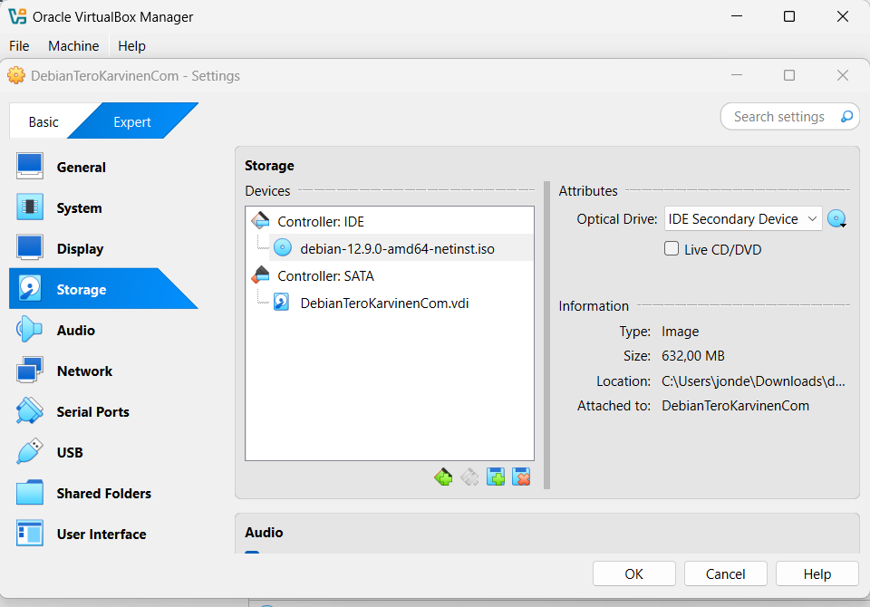
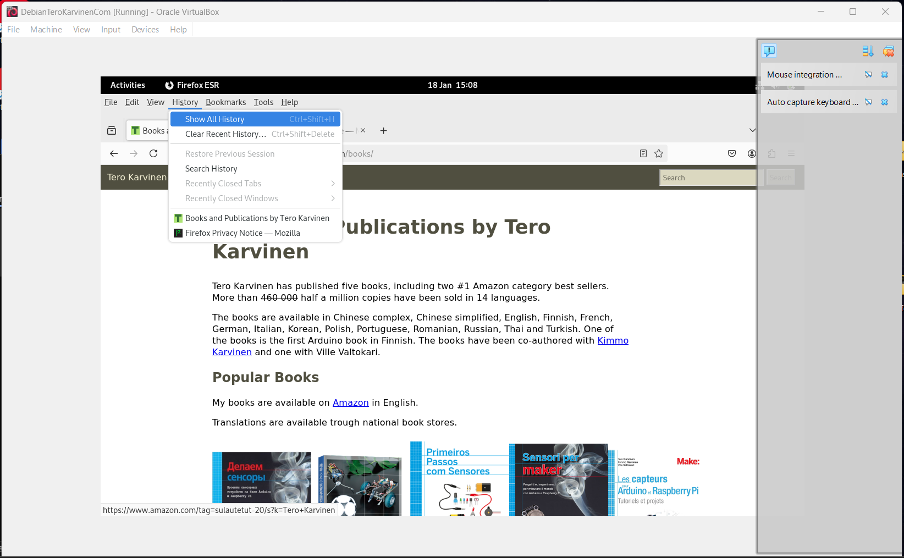

# Asennetaan Debian virtuaalikoneelle

## x) What is Free software?

“Free software” tarkoittaa vapaata ohjelmistoa, ei pelkästään sitä että se on ilmainen kuin ”ilmainen olut” vaan vapaa kuten sananvapaus.
### Neljä olennaista vapautta
-Ajaa ohjelma haluamallansa tavalla, mihin käyttötarkoitukseen tahansa (freedom 0)
-Tutkia kuinka ohjelma toimii ja muuttaa sitä tekemään haluamansa asioita. (freedom 1) Lähdekoodiin käsiksi pääsy on edellytys tähän.
-Levittää ohjelmiston kopioita vapaasti (freedom 2)
-Levittää ohjelmistosta muokattuja versioita vapaasti muille (freedom 3) Jotta koko yhteisö saa muokatun version hyödyt käyttöönsä. Lähdekoodiin käsiksi pääsy on edellytys tähän.

### Termien erot Open Source ja Free Software
Termit ”Open Source” ja “Free Software” usein sekoitetaan keskenään, mutta niillä on filosofiaan perustuvia eroja ja eri arvoja. Sen käytännön määritelmä on myös erilainen, mutta useimmat ”open source” projektit ovat vapaita.
 Tuotteet, jotka on merkitty tähdellä (*), ovat avointa lähdekoodia.

## a)	Alustus 
**Lauantai, 18.1.2025 Klo:14.40**

Tavoitteena luoda uusi virtuaalikone, jolle asennetaan Debian käyttöjärjestelmä. Aluksi tutustuin oman läppärin spekseihin, jota aion kurssin aikana käyttää. 

### Laitteen spesifikaatiot:
64-bit Windows 11
Intel Core i5-1035G1 CPU @1.00GHz  1.20GHz
8GB RAM muistia

Virtualisointiin käytän Oraclen VirtualBox- ohjelmaa.

## Asennus

### Debianin lataus
Debianin verkkosivulta latasin tiedoston ” debian-12.9.0-amd64-netinst”, joka on Debianin viimeisin 12.9.0 versio. Tämä versio toimii Intelin prosessoria käyttävien amd64-arkkitehtuurin koneissa.

### Virtuaalikoneen luominen VirtualBoxilla
VirtualBox on asennettu jo valmiiksi, joten seuraavaksi luomaan uutta konetta.
Luodaan uusi virtuaalikone **Create Virtual Machine** käyttämällä ladattua ISO-tiedostoa ja annetaan sille nimeksi ”DebianTeroKarvinenCom" (ohjeiden mukaisesti).
Tyyppi Linux ja versio Debian (64-bit) Valitaan kohta ”Skip Unattended Install”. 
Asetetaan muistin määräksi 4000MB ja luodaan virtual hard disk, jonka koko on 60GB. 
Virtuaalikoneen alustus on valmis ja seuraavaksi bootataan Debian.
 

## Käynnistys työpöytäympäristöön

Asennusvaiheet
Bootloader käynnistyi, testasin ensin liveä ja asensin Debianin ohjeita seuraamalla. 
Yksi ongelma esiintyi oikean aikavyöhykkeen valitsemisessa, joten valitsin vain eurooppalaisen aikavyöhykkeen, joka on luultavasti United Kingdom UTC +0. 
Jätin hostnimen defaultiksi ”vbox” ja käyttäjänimeksi oma nimi. Debian archive mirroriksi valitsin deb.debian.org. Http proxyn jätin tyhjäksi. 
Software selection kohdassa valitsin ”Debian desktop environment”, ”GNOME”, ”Xfce” ja ”standard system utilities”. 
Debian on nyt asennettu onnistuneesti.
 
**Lauantai, 18.1.2025, Klo 16:30**

## Jatkotoimenpiteet terminaalissa
**Lauantai, 18.1.2025, Klo 18:40**

### Sudo-oikeuksien lisääminen
Seuraavaksi avasin terminaalin ja huomasin, että luomalla käyttäjälläni ei ole sudo-oikeuksia. Googlaamalla selvisi helposti komennot:
$ usermod -aG sudo username
$ sudo whoami
Lähde: Linuxize. How to Add User to Sudoers in Debian. https://linuxize.com/post/how-to-add-user-to-sudoers-in-debian. (Luettu 18.1.2025).

Syötin seuraavaksi terminaaliin komennot:
$ sudo apt-get update
$ sudo apt-get -y dist-upgrade
$ sudo apt-get -y install ufw
$ sudo ufw enable

Nyt palomuuri on asennettu ja laitettu päälle uudelleen käynnistämisen jälkeen.

## Lähteet: 

Verkkosivu: Free Software Foundation. What is Free Software? https://www.gnu.org/philosophy/free-sw.html. (Luettu 18.1.2025).
Verkkosivu: Linuxize. How to Add User to Sudoers in Debian. https://linuxize.com/post/how-to-add-user-to-sudoers-in-debian. (Luettu 18.1.2025).
Kirja: Välimäki, Mikko. The Rise of Open Source Licensing: A Challenge to the Use of Intellectual Property in the Software Industry. Kurssimateriaalin .pdf-tiedosto. (Luettu 18.1.2025)

Tätä dokumenttia saa kopioida ja muokata GNU General Public License (versio 3 tai uudempi) mukaisesti. http://www.gnu.org/licenses/gpl.html
Pohjana Tero Karvinen 2025: Linux kurssi, http://terokarvinen.com
